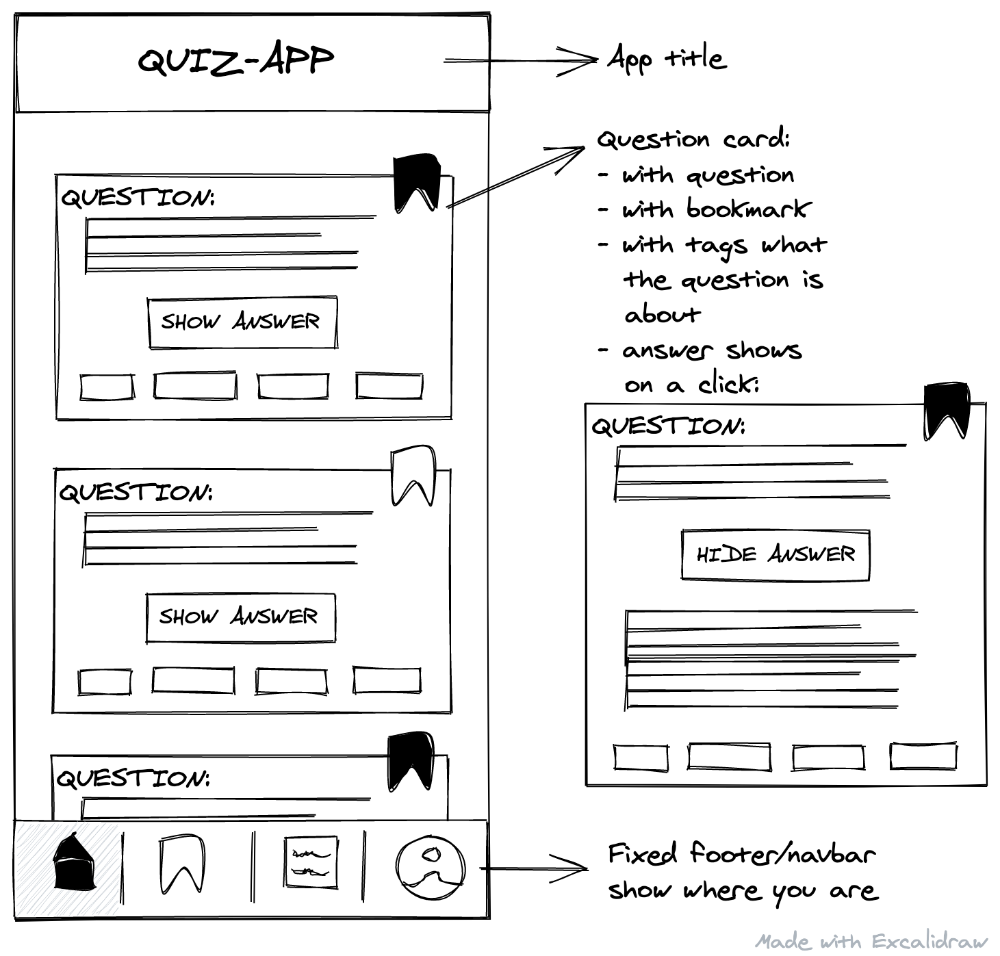
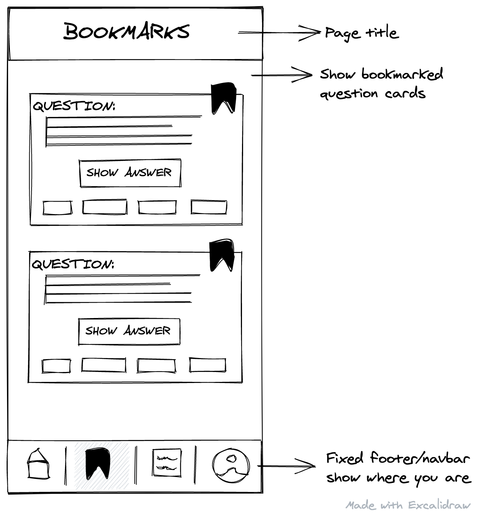
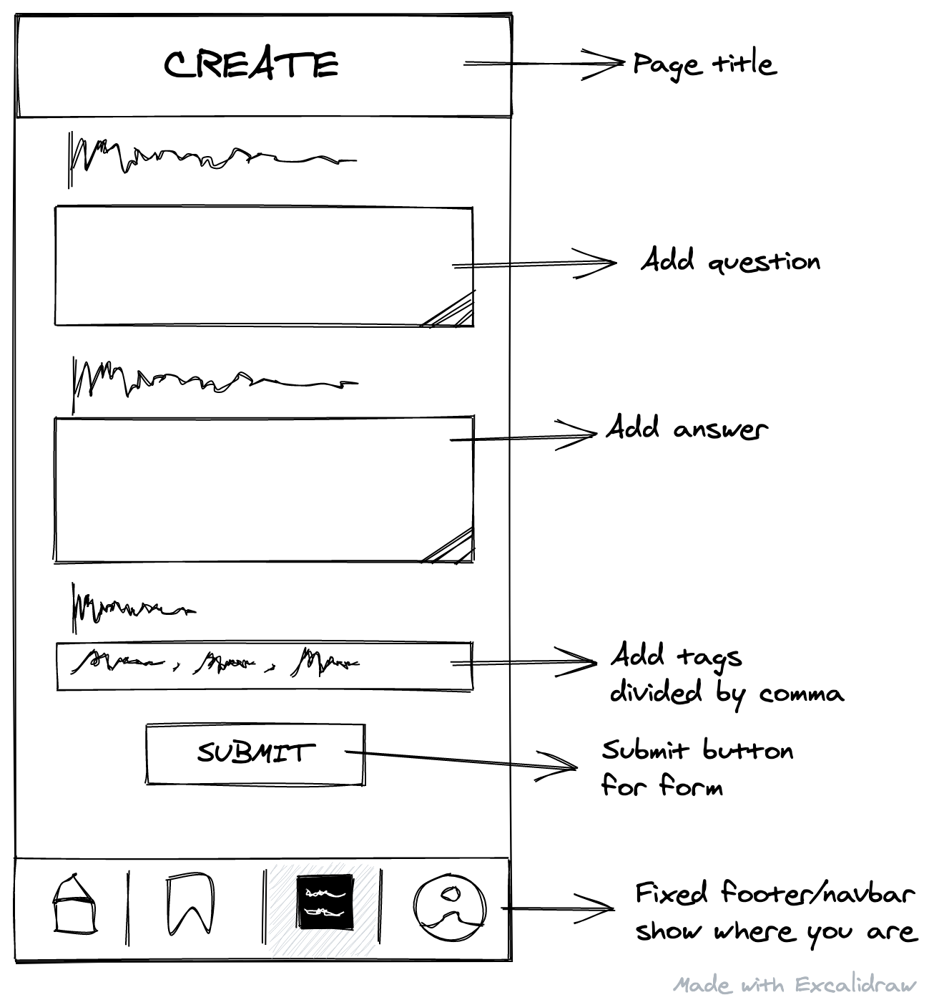
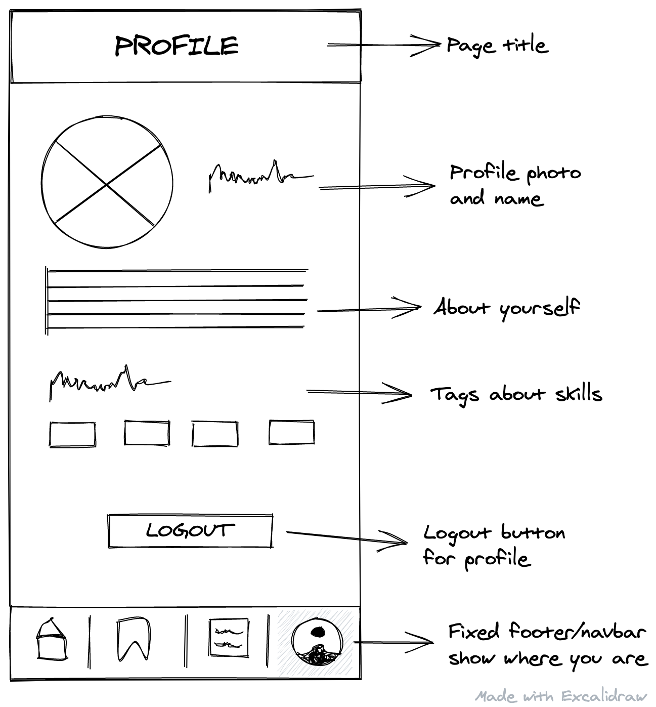

### Assignment

# Quiz App: Markup and Styles

:sparkles: Build your personal Quiz App to practice your knowledge about HTML and CSS! :sparkles:

---

## Wireframes









## Get started

- [Fork](https://docs.github.com/en/get-started/quickstart/fork-a-repo) this repo into your GitHub account. Use the [use this template](https://github.com/mpagels/quiz-app-template/generate) button.
- and then [clone](https://docs.github.com/en/repositories/creating-and-managing-repositories/cloning-a-repository) this repo from your account to your local machine

- after `cloning` change into the new directory and run

```bash
npm install
```

to install storybook

## Next Steps

- add `contributers` to your repo
- start working on the app

- Try to use everything you learned so far:

- git workflow (branches, pull requests, commits, etc.)
- semantic html
- css with BEM
- deploy the app on vercel

## Resources

BEM: https://css-tricks.com/bem-101/
